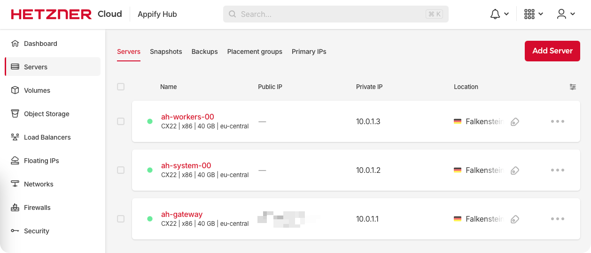

# Cluster Setup using Terraform

The minimal Terraform configuration required to run the AppifyHub services in a Kubernetes (K8s) cluster on Hetzner. This is a companion repository to the [AppifyHub Charts](https://github.com/appifyhub/charts) repository.

### About this Guide

This guide walks you through a minimal Terraform setup required to run the AppifyHub services in the cloud, in a dedicated K8s cluster. It should serve as a starting point for deploying any number of apps and services into a cloud environment, but the default configuration given here is not suitable for high-availability production use.

> ⚠️ &nbsp; Do not use in production environments without modification.

The guide assumes you have a basic understanding of Terraform and cloud infrastructure, and that you wish to deploy a new cluster into [Hetzner Cloud](https://www.hetzner.com/cloud). The configuration is heavily inspired by (or depends on) the following Terraform modules:

  - [Hetzner Terraform Provider](https://github.com/hetznercloud/terraform-provider-hcloud): A Terraform provider for managing Hetzner Cloud resources
  - [K3S Terraform](https://github.com/nimbolus/tf-k3s): A Terraform module for deploying K3S clusters
  - [Hetzner Cloud Terraform + K3S](https://github.com/identiops/terraform-hcloud-k3s): Provides a minimal configuration for running K8s clusters on Hetzner Cloud
  - [Kube-Hetzner](https://github.com/kube-hetzner/terraform-hcloud-kube-hetzner): A Terraform module and guide for deploying K8s clusters on Hetzner Cloud
  - [Google Terraform](https://github.com/terraform-google-modules): Modules for managing Google Cloud resources
  - [AWS Terraform](https://github.com/terraform-aws-modules): Modules for managing Amazon Web Services resources

This guide provides a cloud configuration that you can apply directly or customize to suit your specific needs. The configuration is designed to be modular, allowing you to easily add or remove components as required before deployment.

## Cluster Topology

The following diagram shows the cluster topology you get:

<picture>
  <source media="(prefers-color-scheme: dark)" srcset="media/cluster-topology-dark.png">
  <source media="(prefers-color-scheme: light)" srcset="media/cluster-topology-light.png">
  
</picture>

Here's a brief overview of the components:

  - **Private Network**: Isolated network for our cluster components
  - **Node Pools**: Groups of nodes (cloud servers) with similar roles
    - **Control Plane Pool**: Nodes of this pool manage the cluster and include the critical K8s system components. One node is enough for a minimal setup, but you should have more than one for redundancy and high availability. Control Plane should have an odd number of nodes to avoid split-brain scenarios and ensure the `etcd` quorum is maintained
    - **Workers Pool**: Nodes in this pool run workloads. You can have only one or multiple worker nodes, and they can be scaled up or down as needed. The number of worker nodes doesn't need to be odd, as they don't participate in the `etcd` quorum
  - **Gateway**: Acts as the entry point and a proxy for SSH (port 22 – if enabled) and K8s API (port 6443 – if enabled), avoiding to expose the cluster nodes directly to the Internet. Having only one gateway is a single point of failure, but you can deploy multiple gateways for redundancy. The gateway is not a load balancer, but still has a public IP address for access from the Internet
  - **Load Balancer** (optional): A dedicated cloud server, exposing a public IP address for access from the Internet via HTTP (port 80 – if enabled) and HTTPS (port 443 – if enabled). It is used to route traffic to the control plane and worker nodes, but is not required for a minimal setup. The load balancer is not a K8s component on its own – it is a cloud server from our cloud provider – but it works well with a cluster Ingress controller to route traffic to the appropriate services within the cluster
  - **Cloud Provider Integrations** (optional): Enables cloud provider's auto-provisioning of services, for example CSI (Container Storage Interface), CNI (Container Network Interface), CRI (Container Runtime Interface), and other. This is how the storage volumes and network interfaces are created and managed on the fly. This is not required for a minimal setup
  - **Network Discovery** (optional): Cloud provider's networking and discovery tools, such as load balancers, firewalls, DNS, and other network components. This is not required for a minimal setup

There are simpler ways of setting up K8s clusters. You can use a single node with K3S, or a single node with Minikube, or even a single node with Docker… but this setup is designed to be modular and extensible, allowing you to easily add or remove components as needed.

In short, we impose three main rules with this setup:

  1. For configuration and editing purposes (ssh, kubectl), the cluster's whole private network is accessible only from the gateway that acts as a proxy
  1. For workload purposes (http, https), the cluster's nodes are accessible only from the load balancer that acts as a proxy
  1. While Terraform manages all of our core cloud resources, we allow auto-provisioning of additional cloud services on the fly (e.g., persistent volumes) using the cloud provider's APIs, more specifically using K8s annotations and labels

## Getting Started

### Features

  - [K3S](https://k3s.io) as the K8s distribution
  - [Hetzner Cloud](https://www.hetzner.com/cloud) as the cloud provider
  - [Terraform](https://www.terraform.io): for infrastructure-as-code (IaC) provisioning
  - [Ansible](https://docs.ansible.com): for automation of the provisioning process and running playbooks on multiple nodes at once
  - Flexible node pools where we can easily add, resize, or remove pools to manage resources
  - Automated updates of K8s using the [System Upgrade Controller](https://github.com/rancher/system-upgrade-controller)
  - Automated OS updates and node reboots using [Kured](https://kured.dev)
  - High availability (optional) using placement groups and multi-region deployments for improved resilience
  - Sensible security defaults, deletion protection for cloud resources, SSH key access only, with [fail2ban](https://github.com/fail2ban/fail2ban) for brute-force protection, restricted public network interfaces, internal firewalls
  - Advanced networking and support for network policies via [Cilium](https://github.com/cilium/cilium)
  - Hetzner Cloud integrations using the [Cloud Controller Manager](https://github.com/hetznercloud/hcloud-cloud-controller-manager) for cloud resource management, [Cloud Storage Interface](https://github.com/hetznercloud/csi-driver) for volume management.
  - Get monthly cost estimates and insights directly in Terraform for all core cloud resources
  - … plus many more features, with more to come!

### Prerequisites

Make sure you have the following tools installed on your local machine:

  - [Terraform](https://www.terraform.io/downloads.html) (check: `terraform -v`)
  - [Bash](https://www.gnu.org/software/bash) (check: `bash --version`)
  - [JQ](https://jqlang.org) (check: `jq --version`)
  - [KubeCTL](https://kubernetes.io/docs/tasks/tools/#kubectl) (check: `kubectl version --client`)
  - [SSH](https://www.ssh.com/academy/ssh) (check: `ssh -V`)
  - [Git](https://git-scm.com) (check: `git --version`)
  - [Ansible](https://docs.ansible.com/ansible/latest/installation_guide/index.html) (check: `ansible --version`) – _optional_
  - [Helm](https://helm.sh/docs/intro/install) (check: `helm version`) – _optional_
  - [Cilium](https://docs.cilium.io/en/stable/gettingstarted/k8s-install-default) (check: `cilium version`) – _optional_
  - [Hetzner Cloud](https://www.hetzner.com/cloud) account – _see below for setup_

### Account Setup

  1. Create a [Hetzner Cloud](https://www.hetzner.com/cloud) account
  1. Log in to your Hetzner Cloud account
  1. Create a new project (we have a sample project called "Appify Hub")
  1. Go to the "Security" tab on the left side
  1. Go to the "API Tokens" tab on the top of the Security page
  1. Click on the "Generate API Token" button

<picture>
  <source media="(prefers-color-scheme: dark)" srcset="media/hetzner-api-token-dark.png">
  <source media="(prefers-color-scheme: light)" srcset="media/hetzner-api-token-light.png">
  
</picture>

To complete the setup using this guide, you need to have one token with `Read` permissions, and one token with `Read & Write` permissions.

#### Token Management

  - **Read & Write**: This token is used to create and manage cloud resources. It should be kept secret and not shared with anyone. You can use this token to create and manage cloud resources, such as servers, networks, and load balancers
  - **Read Only**: This token is used to read cloud resources. It should also be kept secret and not shared with anyone. You can use this token to read cloud resources, such as servers, networks, and load balancers, or inspect the costs periodically, or even run proxy commands while accessing the cluster

As our Terraform variables (`terraform.tfvars`) are not stored in the repository and remain invisible to `git` because of our `.gitignore` configuration, you can use the following command to store your tokens in a local file:

```bash
# Create the file
touch terraform.tfvars
# Set the file permissions to read/write only for the owner
chmod 600 terraform.tfvars
# Add the tokens to the file
cat > terraform.tfvars <<EOF
hcloud_token = "your read & write token here"
hcloud_token_read_only = "your read-only token here"
EOF
```

Alternatively, you can set the tokens as environment variables by adding them to your `~/.zshrc` / `~/.zshenv` / `~/.bashrc` / `~/.bash_profile` files (or Windows environment variables panel). When going through this guide, you can use session-specific variables, but they will be lost when you close the terminal. Here's how to set the session-specific variables:

```bash
# Set the read & write token
export TF__VAR_hcloud_token="your read & write token here"
# Set the read-only token
export TF__VAR_hcloud_token_read_only="your read-only token here"
```

### Understanding the Modules

Either clone this repository, or download the `main.tf` file from this repository into the directory where your Terraform variables (`terraform.tfvars`) are stored. Let's open the file and inspect its contents.

This file contains the Terraform configuration for deploying your cluster. The given configuration is set up with AppifyHub's defaults, and you should go through the file to understand what each section does. As the file is heavily commented, you should have some help modifying it to suit your needs.

Here are some notable configuration options:

  - `delete_protection`: Prevents accidental deletion of the cluster. Must be set to `false` before running `terraform destroy`. You can keep it set to `false` while testing
  - `cluster_name`: The name of your cluster, used for identification
  - `hcloud_token`: The Hetzner Cloud API token for managing resources – no change as we created these above
  - `hcloud_token_read_only`: The Hetzner Cloud API token for read-only access – no change as we created these above
  - `gateway_firewall_k8s_open`: Opens the K8s API port (6443) to the Internet. You can leave it turned on while testing, but it is recommended to turn it off in production environments
  - `node_pools.system.count`: The number of control plane nodes in the pool, should be odd for `etcd` quorum (as discussed above)
  - `node_pools.system.cluster_init_action.init`: Allows the node to run cluster initialization. This must be `true` for the first run of `terraform apply`, and `false` for subsequent runs
  - `ssh_keys`: The SSH keys for accessing the cluster nodes. You can use your own SSH key (`~/.ssh/id_rsa.pub`) or generate a new one using the `ssh-keygen` command
  - `ssh_keys_kubeapi`: Similar to the above, but for accessing the K8s API via port-forwarding

Here are some notable outputs you can expect:

  - `gateway`: The IP address of the gateway node
  - `node_pools`: The IP addresses of the worker node pools
  - `total_monthly_costs`: The total monthly costs for running the cluster, including the control plane, worker nodes, networks, public IPs, and other resources this configuration creates
    - Note that these costs don't include the [costs of external load balancers](https://www.hetzner.com/cloud/load-balancer) or the [costs of storage volumes](https://www.hetzner.com/cloud#volumes), as they are not created by default and you may not want them in your setup

### Deploying the Cluster

Assuming your `main.tf` is configured for your needs now, let's check what happens if we run the plan _(no changes will be made yet)_:

```bash
# Initialize the Terraform configuration
terraform init
# Check the Terraform plan (dry run)
terraform plan
```

This command will show you what resources will be created, modified, or destroyed. Because of our "outputs" configuration, it should also show you the costs of the resources that will be created. Let's see what happens with our defaults:

```toml
Plan: 22 to add, 0 to change, 0 to destroy.

Changes to Outputs:

  + gateway             = {
      # ...
      + name     = "ah-gateway"
      + public   = {
          + ipv4 = (known after apply)
        }
      # ...
    }

  + node_pools          = {
      + system  = {
          # ...
          + is_control_plane = true
          + node_count       = 1
          # ...
        }
      + workers = {
          # ...
          + is_control_plane = false
          + node_count       = 1
          # ...
        }
    }

  + total_monthly_costs = {
      + currency   = "EUR"
      + net        = 9.87
      + node_count = 3
    }
```

In summary, we are creating **22 connected resources**, including two node pools (one for the control plane and one for the workers), and a gateway server. The total monthly cost is estimated to be around 9.87 EUR, which is approximately the cost of 3 small cloud servers with Hetzner Cloud. Again, the costs of external load balancers or storage volumes are not included in this estimate.

> ⚠️ &nbsp; Cost Notice: Hetzner Cloud is a paid service. Continuing from here will create cloud resources and you will be charged for what you create. Make sure to delete the resources when you are done testing to avoid unexpected charges.

If you are happy with the plan, you can go ahead and apply it:

```bash
# Apply the plan
terraform apply
# If prompted for confirmation, type "yes"
$ Enter a value: yes
```

This command will create the resources in the cloud. It may take a few minutes to complete, depending on the number of resources being created. You can monitor the progress in the terminal.

Once done, you will see a summary of the resources created, including the IP addresses of the nodes and the gateway. You can also see the total monthly costs for running the cluster. This should all be available also in the Hetzner Cloud console:

<picture>
  <source media="(prefers-color-scheme: dark)" srcset="media/hetzner-console-servers-dark.png">
  <source media="(prefers-color-scheme: light)" srcset="media/hetzner-console-servers-light.png">
  
</picture>

Well done – you now have a K8s cluster running in the cloud, with a gateway server and a worker node pool! 🎉

#### Deleting the Cluster

To undo the changes and destroy the resources, you can run the following command:

```bash
# Destroy the resources
terraform destroy
# Forget the known hosts
rm -f .ssh/known_hosts
```

## Managing the Cluster

Let's look at how you can manage your new cluster. The following sections will cover how to access the nodes, manage the K8s API, and run maintenance tasks on the cluster.

#### Auto-Generated Tools

You might have noticed that some additional files and folders have been generated in the directory where you ran the `terraform apply` command. This is intentional and expected. These files are used to manage the cluster and provide access to the nodes.

Here's a quick overview of those

  - `.ssh/config`: A configuration file for SSH, allowing you to easily access the nodes using their aliases. You can inspect this file and use the node aliases to SSH into the nodes without having to specify the IP address each time
  - `./ls-nodes`: A script that lists all the nodes in the cluster
  - `./ssh-node`: A script that allows you to SSH into the nodes, correctly proxying through the gateway
  - `./scp-node`: A script that allows you to copy files to and from the nodes, correctly proxying through the gateway
  - `.ssh/known_hosts`: A file that contains the SSH fingerprints of your cluster's nodes. This file is automatically updated and used to verify the identity of the nodes when you've SSH'ed into them for the first time
  - `.ansible/hosts`: Similarly to the SSH configs, this file contains the inventory of the nodes for Ansible. You can use this file to run Ansible commands and playbooks on groups of nodes at once
  - `./setkubeconfig`: A script that sets up your new cluster as the default K8s context, allowing you to use `kubectl` commands to manage the cluster without having to specify the context each time
  - `./unsetkubeconfig`: "Undo" for the script mentioned above

### Cluster Initialization

Once the cluster resources are created, you may think that you can now access the nodes and the K8s API. However, this is not the case. Your cluster will take several minutes to initialize using the `cloud-init` tool – but you can monitor the progress while patiently waiting.

You can use the `./ls-nodes` script to list all the nodes available in the cluster, and then use the `./ssh-node` script to SSH into any of them. Let's now use the `ssh-node` script to SSH into the main control-plane node and check its status. 

> ⚠️ &nbsp; Be careful to not over-request SSH connections to your nodes if you see failures, because you may get your IP banned.

```bash
# SSH into the main control plane node
./ssh-node cluster
```

You will be prompted to confirm the SSH fingerprint of the node. Type "yes" to continue. You should now be logged into the node, and the fingerprint should be saved in the `.ssh/known_hosts` file. You can now run commands on the node as if you were logged in directly.

In there, we want to check the status of `cloud-init`:

```bash
# Check the status of cloud-init
cloud-init status
# Or if you'd like to actively wait until it's done
cloud-init status --wait
# Or if you'd like to see updates while waiting
while cloud-init status | grep -q "status: running"; do
    echo "Cloud-init is still running..."
    sleep 5
done
echo "Cloud-init has completed!"
```

We want to see `status: done` there, which would mean you're good to go and the cluster is ready to use via the K8s API. If you got an error, check the troubleshooting section below.

#### Verification

```bash
# Verify the K8s setup (from inside the node)
kubectl cluster-info
```

If these tests were successful, you can now `exit` your node and run the `./setkubeconfig` script to set up your K8s context to your new cluster. Assuming you allowed the firewall to expose port 6443 on the gateway, running this script will allow you to use `kubectl` commands to manage the cluster without having to specify the context each time.

```bash
# Set up the K8s context
./setkubeconfig
# Verify the K8s setup (from outside the node)
kubectl cluster-info
# Check the nodes in the cluster
kubectl get nodes
```

If you haven't allowed your firewall to expose port 6443 on the gateway, you can still use `kubectl` commands to manage the cluster, but you will need to do it from inside the gateway node. You can do this by SSH'ing into the gateway node (`./ssh-node gateway`) and running the `kubectl` commands from there. Note: you may need to set up port forwarding inside of the gateway to access the K8s API in the cloud's private network.

> Pro tip: One of the best ways to inspect your cluster is to use [K9s CLI](https://k9scli.io). Your K8s context remains active for K9s as well, so you should be directly connected to your new cluster.

#### Ansible

As mentioned in the files overview, we now have the Ansible inventory file (`.ansible/hosts`) auto-generated for us, so we can run Ansible commands and playbooks on groups of nodes at once. You can use the `ansible` command to run ad-hoc commands on the nodes, or use `ansible-playbook` to run playbooks.

```bash
# Check the Ansible inventory
ansible -i .ansible/hosts all_nodes --list-hosts
# Run a simple 'whoami' command on all nodes
ansible -i .ansible/hosts all_nodes -m shell -a "whoami"
# Reboot all worker nodes (no need to actually run it now)
ansible -i .ansible/hosts all_worker_nodes -m shell -a "reboot now"
```

### Troubleshooting

This section covers some of the most common issues you might face with this setup.

#### Initialization Issues

The three most common statuses of `cloud-init` are `running`, `done`, and `error`. In case you see an error at any point of this setup, you can run some of the following checks and inspect the outputs:

```bash
# Check the schema of the cloud-init config
cloud-init schema --system
# Collect logs for inspection
cloud-init collect-logs
tar xvzf cloud-init.tar.gz
tail -f cloud-init.log
# Quickly find 'runcmd' and run it again
find /var/lib/cloud/instances -name runcmd
sh -ex PATH_TO_YOUR_ACTUAL_RUNCMD_GOES_HERE
```

Haven't found anything interesting in the logs?

  - Did you turn on the `init` flag in your `main.tf` for the first `terraform apply`?
  - Have you tried asking your favorite AI or search engine?
  - Have you tried opening a GitHub issue?

#### Connectivity Issues and Unreachability

If cluster nodes become unreachable after a few days (via SSH or K8s API), consider these potential causes:

  1. **Cilium networking issues** – Cilium provides CNI functionality but may encounter stability issues
  1. **Connection tracking table limits** – Network connection tracking may become exhausted
  1. **Network interface problems** – Interface connectivity to the private network may fail
  1. **SSH service failures** – The SSH daemon might stop responding

Diagnosing and resolving connectivity issues can be challenging, especially if the nodes are unreachable. Here are some first steps to help you troubleshoot:

  - **SSH into the gateway**: Use the `./ssh-node gateway` script to SSH into the gateway node and check the status of the nodes from there
  - **SSH into the control-plane**: Use the `./ssh-node cluster` script to SSH into the gateway node and check the status of the nodes from there
  - **Check Cilium status**: Use `kubectl get pods -n kube-system` to check the status of Cilium pods. If they are not running, you may need to restart them or check their logs
  - **Check connection tracking table**: Use `cat /proc/net/ip_conntrack` to check the connection tracking table from each node. If it is full, you may need to increase the size of the table
  - **Check network interfaces**: Use `ip a` to check the status of network interfaces in nodes. If they are down, you may need to bring them up manually
  - **Check SSH service**: Use `systemctl status ssh` to check the status of the SSH service. If it is not running, you may need to restart it

We can also deploy some advanced monitoring and auto-fix tools to help us with these issues. The following tools are included in the `monitoring-setup.yml` playbook and the `network-check-fix.sh` script. You can enable them by running the following commands:

```bash
# Deploy the advanced monitoring setup to all nodes
ansible-playbook -i .ansible/hosts monitoring-setup.yml

# Deploy the network check script on all nodes
ansible -i .ansible/hosts all_nodes -m copy -a "src=network-check-fix.sh dest=/usr/local/bin/network-check-fix.sh mode=0755"
# Run the network check script on all nodes
ansible -i .ansible/hosts all_nodes -m shell -a "/usr/local/bin/network-check-fix.sh"
```

This setup provides:

  - System snapshots every 5 minutes in `/var/log/system-monitor/`
  - Cilium health checks hourly in `/var/log/cilium-health/`
  - Network validation and auto-repair in `/var/log/network-fixes/`
  - Enhanced SSH logging for connection diagnostics

If nodes become unreachable, check these log directories after running a manual Power Cycle to identify the root cause. Once done, you can remove the monitoring tools like this:

```bash
# Remove monitoring services and timers
ansible -i .ansible/hosts all_nodes -m systemd -a "name=system-monitor.timer state=stopped enabled=no"
ansible -i .ansible/hosts all_nodes -m systemd -a "name=cilium-health-check.timer state=stopped enabled=no"
ansible -i .ansible/hosts all_nodes -m file -a "path=/etc/systemd/system/system-monitor.service state=absent"
ansible -i .ansible/hosts all_nodes -m file -a "path=/etc/systemd/system/system-monitor.timer state=absent"
ansible -i .ansible/hosts all_nodes -m file -a "path=/etc/systemd/system/cilium-health-check.service state=absent"
ansible -i .ansible/hosts all_nodes -m file -a "path=/etc/systemd/system/cilium-health-check.timer state=absent"
ansible -i .ansible/hosts all_nodes -m file -a "path=/usr/local/bin/system-monitor.sh state=absent"
ansible -i .ansible/hosts all_nodes -m file -a "path=/usr/local/bin/cilium-health-check.sh state=absent"
ansible -i .ansible/hosts all_nodes -m file -a "path=/usr/local/bin/network-check-fix.sh state=absent"
ansible -i .ansible/hosts all_nodes -m file -a "path=/etc/cron.d/network-check-fix state=absent"
ansible -i .ansible/hosts all_nodes -m file -a "path=/var/log/system-monitor state=absent"
ansible -i .ansible/hosts all_nodes -m file -a "path=/var/log/cilium-health state=absent"
ansible -i .ansible/hosts all_nodes -m file -a "path=/var/log/network-fixes state=absent"
```

#### DHCP Lease Issues

This particular cluster setup comes with pre-configured node networking routes and IP forwarding rules that are part of our pre-configured private network (with a ⁠`/24` subnet). The cloud provider’s default network configuration is usually in a `⁠/32` subnet. Because nodes may request a new IP configuration from the authoritative DHCP server during boot, adopting that new network routing configuration can cause setup failure when multiple nodes are rebooted simultaneously (especially if control-plane is also unreachable).

In a nutshell, the affected nodes could be searching for other cluster nodes through the wrong network space, unable to find their neighbors. This issue will likely generate numerous `HA-Proxy` error messages or even cause a **complete loss of SSH/K8s connectivity** to the nodes. The cluster Gateway generally does not experience this problem because it sits on the outer boundary of the private network, having a public IP address attached to it (as shown in the cluster topology chart).

With Kured, Cilium and OS updates frequently requiring our nodes to reboot, loss of network state remains a risk. In order to force nodes into respecting their base network configuration, you can do one of the two following things:

##### 1. Remove [`hc-utils`](https://github.com/hetznercloud/hc-utils)
  
Recommended, as per [Hetzner's guidelines](https://github.com/identiops/terraform-hcloud-k3s/pull/28#issuecomment-2778063147). HC Utils will stop the DHCP service from provisioning your nodes with new network configuration.

```bash
# See https://github.com/identiops/terraform-hcloud-k3s/issues/27
# Remove hc-utils as they're not needed for manually network-configured nodes
ansible -i .ansible/hosts all_nodes -m shell -a "apt-get remove hc-utils -y"
ansible -i .ansible/hosts all_nodes -m shell -a "apt-get autoremove -y"
ansible -i .ansible/hosts all_nodes -m shell -a "apt-get autoclean -y"
```

##### 2. Deactivate [`dhcpd`](https://linux.die.net/man/8/dhcpd)
  
Not recommended anymore, as per [Hetzner's guidelines](https://github.com/identiops/terraform-hcloud-k3s/pull/28#issuecomment-2778063147).

```bash
# See https://github.com/identiops/terraform-hcloud-k3s/issues/27
# Disable dhcpd and net-scan since it is in conflict with systemd-networkd
systemctl disable --now hc-net-ifup@enp7s0.service || true
systemctl disable hc-net-scan.service
mv /lib/udev/rules.d/81-hc-network-interfaces.rules /lib/udev/rules.d/81-hc-network-interfaces.rules.legacy
```

The previously shared Ansible Playbooks and scripts for troubleshooting also restart the `systemd-networkd` service on a regular basis, potentially also eliminating this issue by applying a different approach.

#### Further Maintenance and Troubleshooting

We find the [Identiops](https://github.com/identiops/terraform-hcloud-k3s/blob/main/README.md#add-nodes-or-node-pools) guide a great resource for further reading and maintenance of your cluster. It covers how to add nodes or node pools, how to manage the K8s API, and how to run maintenance tasks on the cluster such as OS upgrades, network policy changes, and other tasks.

## Apps and Services

This repository and the accompanying Terraform configuration are designed to be a starting point for deploying any number of apps and services into a cloud environment. However, this repository does not explore the deployment of any specific apps or services. Instead, it focuses on the infrastructure and configuration required to run those apps and services in a cloud environment.

### Load Balancer and Persistent Volumes

Load Balancers and Persistent Volumes are K8s components that are not core to the cluster infrastrucure. As you could see previously, the cluster operates fine without those.

For that reason, we don't include additional information about Ingress, Load Balancers or Persistent Volumes in this guide – instead, the companion repository with [AppifyHub's favorite Helm Charts](https://github.com/appifyhub/charts) is where you can find the actual apps and services that you can deploy into your new cluster, how to do that, and how to test your new setup further.

The other repository also includes detailed instructions on how to set up load balancing and databases, as well as security and secret management tools. You can use those Helm charts to deploy many apps and services into your cluster, and you can customize the charts to suit your specific needs.
